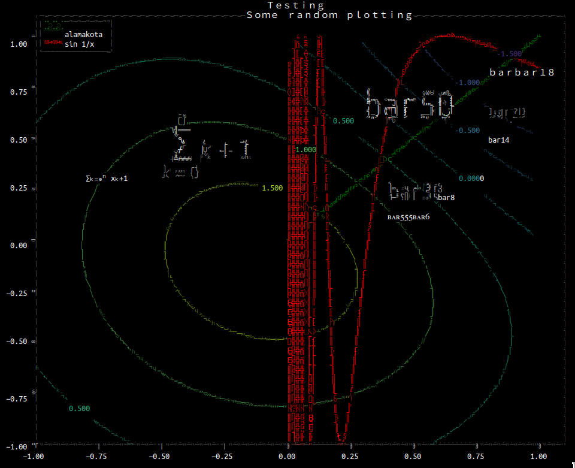
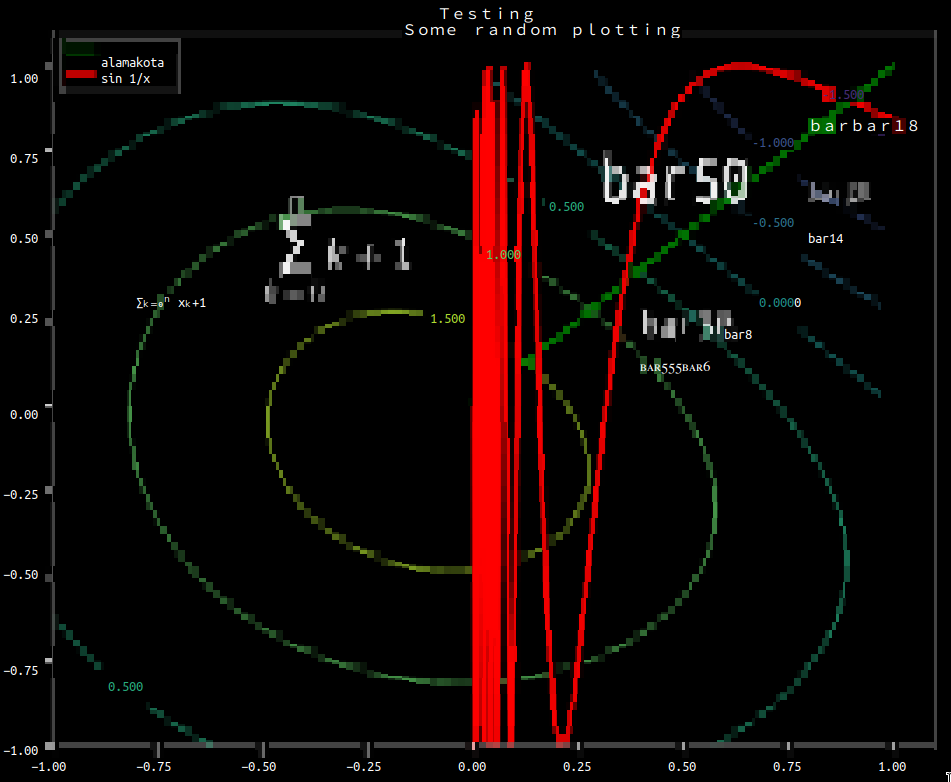
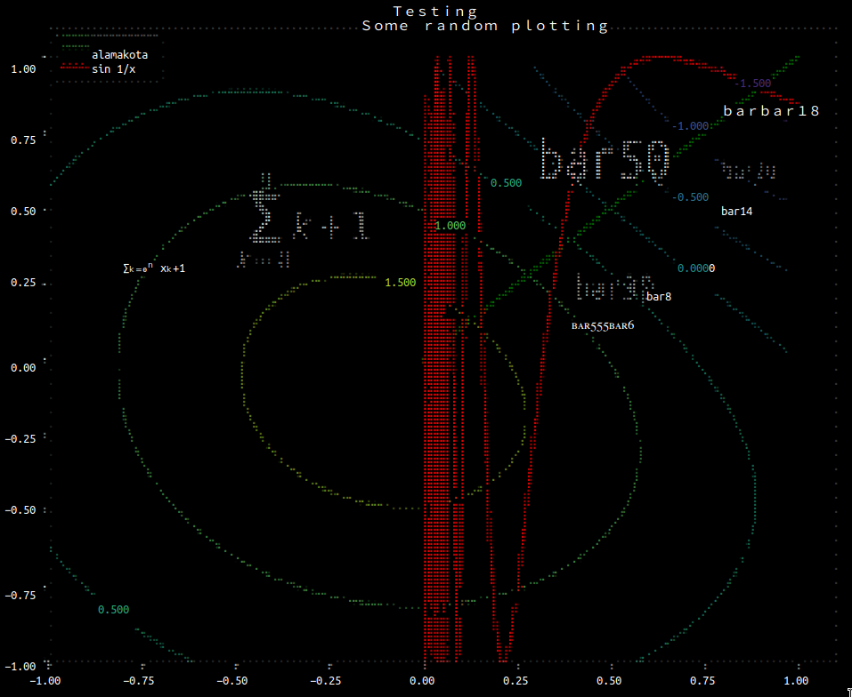

# matplotlib-terminal
Matplotlib backend to plot in terminal using [matrach/img2unicode](https://github.com/matrach/img2unicode)

This is in proof of concept stage, so stay tuned!
The library is optimized for Gnome Terminal with Ubuntu Mono font.
Nevertheless `'block'` and `'braille'` renderers should work with most modern terminals.

Install it with:
```sh
$ pip install matplotlib-terminal
```

To speed ~10x up the ``braille`` and ``gamma`` renderers, install an optional dependency of ``img2unicode``:
```sh
$ pip install 'img2unicode[n2]'
```


Usage:
```python
import matplotlib_terminal
import matplotlib.pyplot as plt
# Or in short:
# from matplotlib_terminal import plt


plt.plot([0, 1], [0, 1])
plt.plot([1, 0], [0, 1], lw=3)
plt.scatter([0], [.5])

plt.show()
plt.show('gamma') # Use RendererGamma-fast/noblock from img2unicode renderer
plt.show('block') # Use Renderer-fast/block from img2unicode, dual color!
plt.show('braille') # Use RendererGamma-fast/braille from img2unicode renderer
plt.close()
```

## Sample results
Gamma renderer:

Block renderer:

Braille renderer:


## TODO

 - [ ] figure out how to configure the lib in matplotlib-ish way (eg. rcParams)
 - [ ] allow to specify figure size in terms of cells
